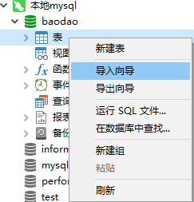
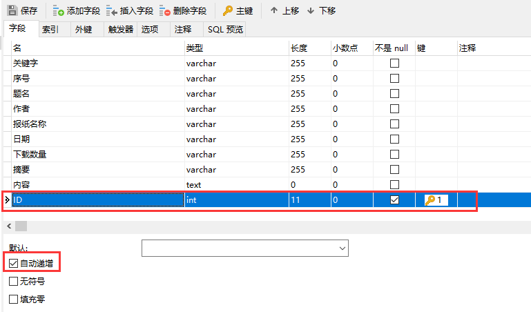

处理报道数据
---

## 1.创建数据库，名为【baodao】


## 2.从excel中导入数据(注意修改表名为【data】)




**选择excel文件**


**修改表名为【data】**


## 3.添加字段【内容】设置为longtext类型


## 4.添加字段【ID】设置为自增长



## 5.添加索引


## 6.去重

```sql
-- 去重前数量: 647176
select count(id) from data;
-- 去重
delete from data where id not in (select * from (select min(id) from data group by 题名, 日期, 报纸名称) as temp);
-- 去重后数量: 520129
select count(id) from data;
```

## 7.预处理

```sql
-- 题名
update data set 题名=replace(trim(题名), ' ', '');
update data set 题名=replace(题名, '　', '');

-- 日期
update data set 日期=replace(trim(日期), ' ', '');
update data set 日期=replace(日期, '　', '');
update data set 日期=replace(日期, '/', '-');

-- 报纸名称
update data set 报纸名称=replace(trim(报纸名称), ' ', '');
update data set 报纸名称=replace(报纸名称, '　', '');
```

## 8.为python安装mysql

方法1：在线安装(较慢)
```
pip install mysql-connector
```

方法2：离线安装(下载mysql-connector-2.1.6.tar.gz)
```
pip install mysql-connector-2.1.6.tar.gz
```

## 9.把报道由pdf和caj转为txt

## 10.执行函数9【提取报道信息】